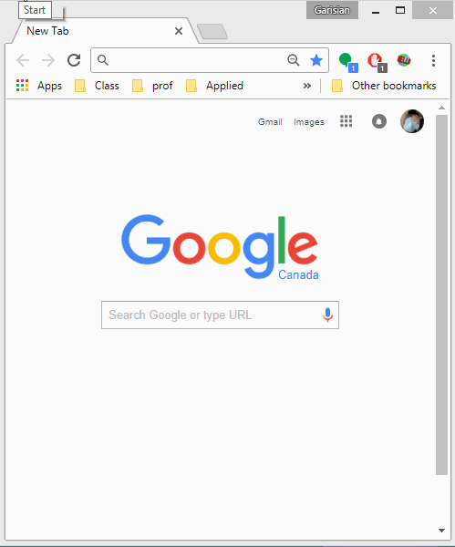

# BookMeNow
BookMeNow is a chome extension that allows the user to quickly bookmark fragements of a webpage and store them for future use.
Initially created for bookmark sharing but more frequently used to record quotes and phrases for essays and academia-related work.

## Usage
Simply open up any website and click on the extension and "Title" and "URL" fields are automatically populated. Highlighting any chunk of text dynamically updates "Summary" field. 

Below is a demo of the app in action

## Installation
Note: BookMeNow is still in active development. Currently implementing accounts and a database to hold the data.

Clone or manually download the zip for this project. Go to chrome://extensions/ and "Load Unpacked Extensions". Proceed to the directory and select BookMeNow and have fun! 

If you want to change the server, change the following line: 

      var postUrl = 'http://httpbin.org/post';

in js/popup.js. Make sure the server accepts the appropriate POST requests and sends back proper response status'.
